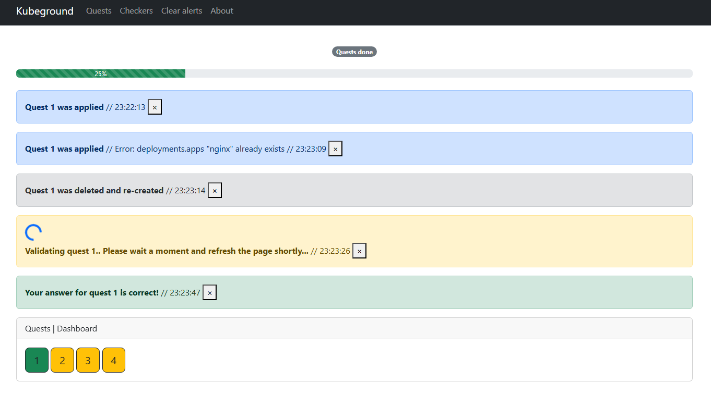
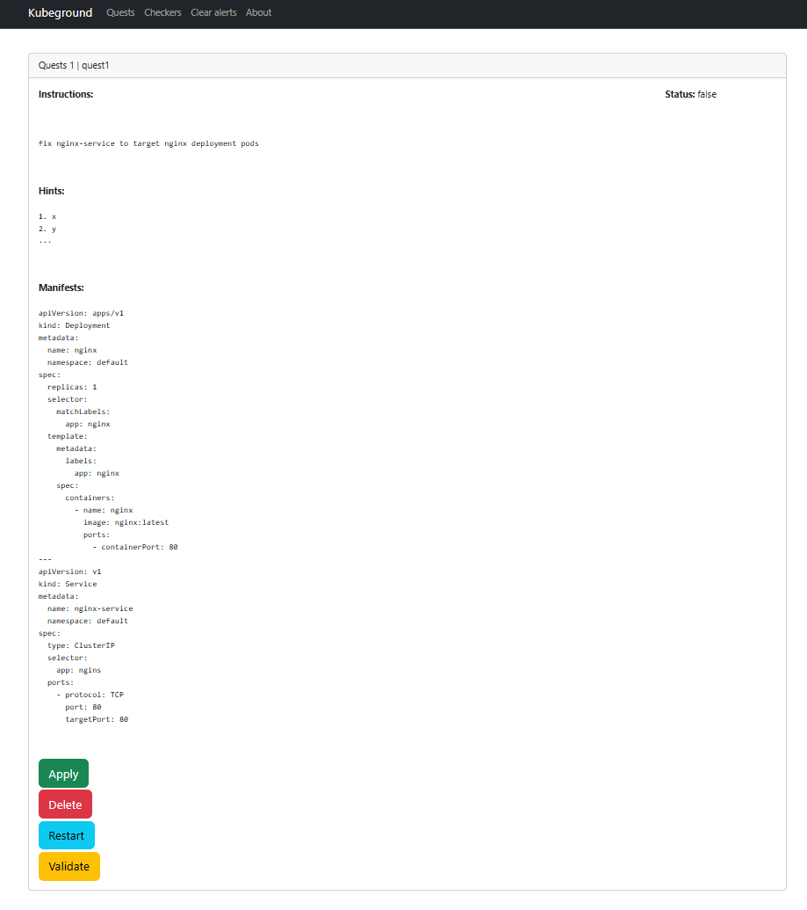
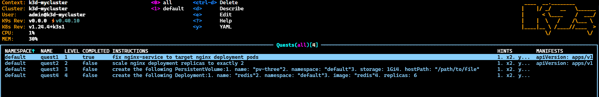
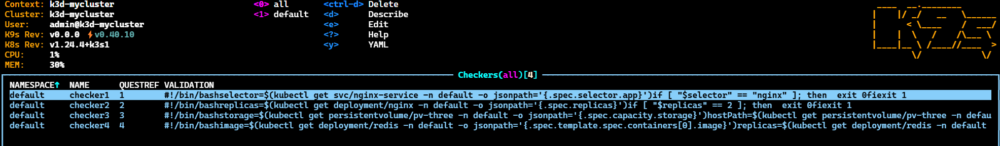

[](https://github.com/slinkity/slinkity/blob/main/LICENSE.md)

# kubeground

> 🚧 **This project is heavily under construction!** 🚧

Discover kubeground, an open-source app that provides Kubernetes training in a unique and engaging way. With hand-picked challenges, you can learn Kubernetes by troubleshooting different components of the system. As you progress through the levels, you'll gain valuable experience and deepen your understanding of this powerful technology.

- 🎮 **Gamify kubernetes learning** Experience a fun and engaging way to improve your Kubernetes knowledge with our hand-picked, unique challenges. Solve each level by troubleshooting your local cluster, and enjoy the process of leveling up your skills.
- 🔋 **Batteries included** Have no lagging experience while using the product (thanks Echo!).
- 📖 **Comprehensive level documentation included** All levels should have clear description & documentation.

## Technologies used

kubeground uses many popular open source tools, including:

1. [**Go Echo:**](https://echo.labstack.com/) High performance, extensible, minimalist Go web framework.
2. [**kubernetes/client-go:**](https://github.com/kubernetes/client-go) Go clients for talking to a kubernetes cluster.
3. [**Kind:**](https://kind.sigs.k8s.io/) Kind is a tool for running local Kubernetes clusters using Docker container "nodes". Kind was primarily designed for testing Kubernetes itself, but may be used for local development or CI.
4. [**Crossplane + Provider:**](https://crossplane.io/) Crossplane is an open source Kubernetes add-on that enables platform teams to assemble infrastructure from multiple vendors, and expose higher level self-service APIs for application teams to consume.
5. [**ArgoCD:**](https://argoproj.github.io/cd/) ArgoCD is a declarative, GitOps continuous delivery tool for Kubernetes that automates the deployment of applications to specified target environments.
6. [**Terraform:**](https://www.terraform.io/) Terraform is an open-source infrastructure as code software tool that enables you to safely and predictably create, change, and improve infrastructure.
7. [**AWS:**](https://aws.amazon.com/) Amazon Web Services offers reliable, scalable, and inexpensive cloud computing services for businesses and individuals.
8. [**Custom kubernetes operator:**](https://kubernetes.io/docs/concepts/extend-kubernetes/operator/) Kubernetes operators are software extensions to Kubernetes that make use of custom resources to manage applications and their components.
## Images





## Getting started

### Prerequisites
1. Have local cluster running
2. Deploy quest-operator
3. Apply Quests + Checkers
4. Run/Deploy kubeground

### Run steps
```bash
# Install local cluster
k3d cluster create -c cluster/k3d.yml

# Install vCluster
helm upgrade --install my-vcluster vcluster --repo https://charts.loft.sh --create-namespace --namespace team-x --repository-config='' --set sync.toHost.ingresses.enabled=true --version 0.20.0-beta.5

# Install helm charts
helm install quest-operator ./charts/quest-operator/ --create-namespace -n quest-operator
helm install kubeground ./charts/kubeground --create-namespace -n kubeground

# Install crossplane
helm repo add crossplane-stable https://charts.crossplane.io/stable
helm repo update
helm upgrade --install crossplane --namespace crossplane-system --create-namespace crossplane-stable/crossplane

# Prepare quests & checkers CRs
kubectl apply -f levels --recursive

# Run the webserver
go run main.go
```

### Cleanup
```bash
k3d cluster delete -a
```

### Build docker
```bash
docker build -t looty10/kubeground:v1.0.0 .
docker push looty10/kubeground:v1.0.0
```

### Build helm charts:
#### Kubeground
```bash
aws ecr-public get-login-password --region us-east-1 | helm registry login --username AWS --password-stdin <repository-url>
helm package charts/kubeground
helm push kubeground-1.0.0.tgz oci://<repository-url>/kubeground/
rm kubeground-1.0.0.tgz
```

#### Quest-operator
```bash
aws ecr-public get-login-password --region us-east-1 | helm registry login --username AWS \ --password-stdin <repository-url>
helm package charts/quest-operator
helm push quest-operator-1.0.0.tgz oci://<repository-url>/kubeground/
rm quest-operator-1.0.0.tgz
```

Navigate to the local [dashboard](localhost:4000/) to start init some levels

## Feature set

This project is still in early alpha, so we have many features soon to come!<br>
For reference, here's our complete roadmap of current and upcoming features:

| Feature                                                                                                         | Status |
| --------------------------------------------------------------------------------------------------------------- | ------ |
| Create and delete kubernetes resources dynamically from YAML files:                                             | ✅     |
| Build a fast API server with Go Echo to handle business logic                                                   | ✅     |
| Utilize GORM to save and query level state                                                                      | ✅     |
| Develop a user-friendly frontend dashboard                                                                      | ⏳     |
| Connect the frontend with the backend via API                                                                   | ⏳     |
| Display table of all levels                                                                                     | 📬     |
| Add a button to quickly initialize and clean a level                                                            | 📬     |
| Add dynamic configuration for each level, including objectives, tips, and solutions, displayed in the dashboard | 📬     |
| Create unit tests for frontend                                                                                  | 📬     |
| Create unit tests for backend                                                                                   | 📬     |
| Validate the product with other local Kubernetes CLIs, such as k3d, ..                                          | 📬     |

- ✅ = Ready to use
- ⏳ = In progress
- 📬 = Not yet started

## Have an idea? Notice a bug?

We'd love to hear your feedback! Feel free to log an issue on our [GitHub issues page](https://github.com/Looty/kubeground/issues).
